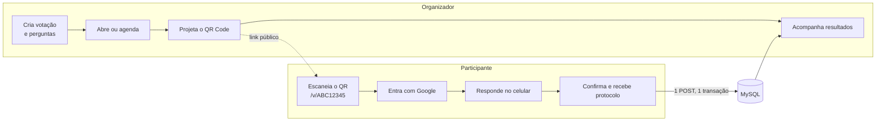
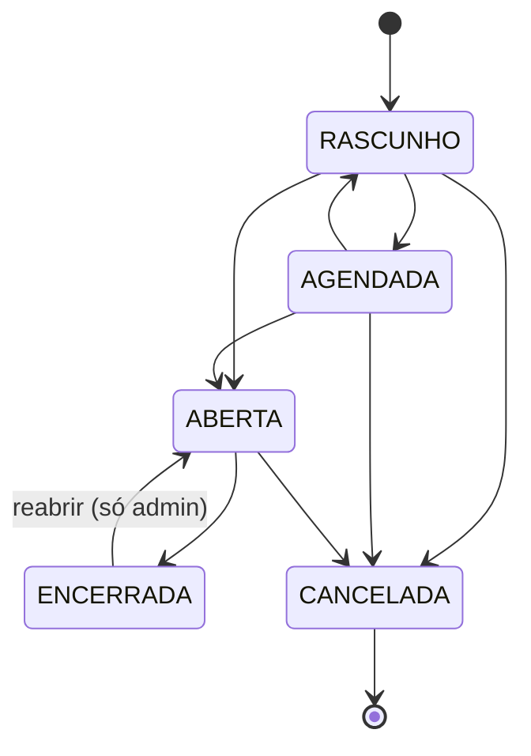
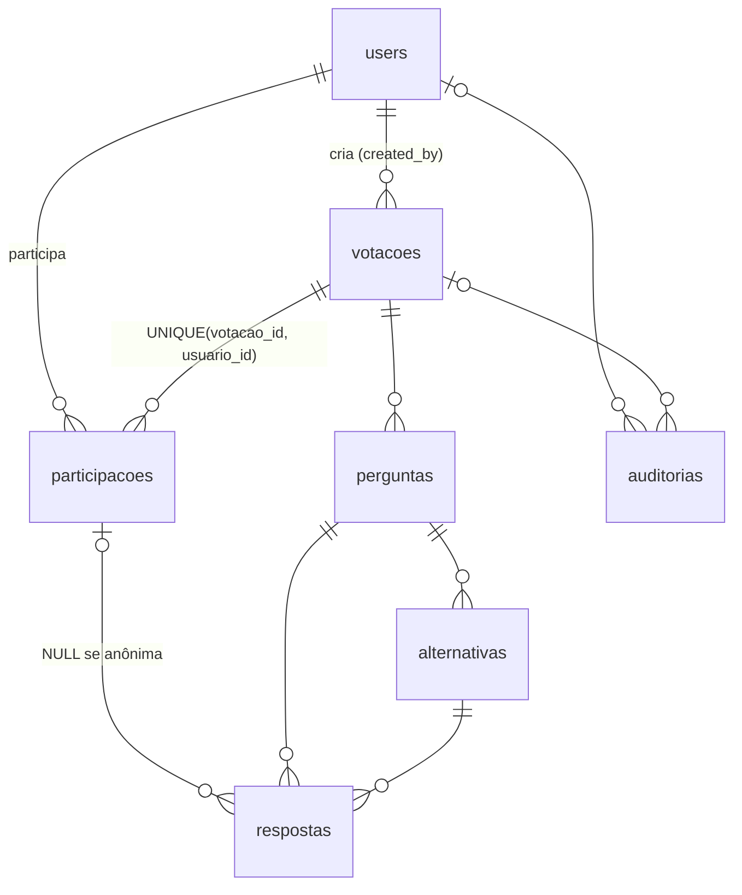

# VotaFlow

Sistema web de **votação online via QR Code**. O organizador cria a votação e projeta o QR Code. O participante aponta a câmera, entra com a conta Google, responde as perguntas e confirma. Ao final, recebe um protocolo.

O sistema foi feito para eventos com **muitas pessoas votando ao mesmo tempo**. Nenhum voto se perde, ninguém vota duas vezes e os números não ficam inconsistentes.

**Stack:** PHP 7.4 · Laravel 8 · MySQL 8 (SQLite em dev) · Redis · Blade + Alpine.js · Tailwind CSS v4 · Google OAuth 2.0 (Socialite) · simple-qrcode

---

## Sumário

1. [Visão geral do funcionamento](#1-visão-geral-do-funcionamento)
2. [Perfis de acesso](#2-perfis-de-acesso)
3. [Ciclo de vida de uma votação](#3-ciclo-de-vida-de-uma-votação)
4. [Fluxo do organizador](#4-fluxo-do-organizador)
5. [Fluxo do participante](#5-fluxo-do-participante)
6. [Tipos de pergunta](#6-tipos-de-pergunta)
7. [Privacidade do voto](#7-privacidade-do-voto)
8. [Como o voto é registrado](#8-como-o-voto-é-registrado)
9. [Login com Google e perfil](#9-login-com-google-e-perfil)
10. [Resultados e atualização em tempo real](#10-resultados-e-atualização-em-tempo-real)
11. [Auditoria](#11-auditoria)
12. [API v1](#12-api-v1)
13. [Modelo de dados](#13-modelo-de-dados)
14. [Estrutura do código](#14-estrutura-do-código)
15. [Configuração (.env)](#15-configuração-env)
16. [Como rodar](#16-como-rodar)
17. [Testes](#17-testes)
18. [Pontos de atenção](#18-pontos-de-atenção)
19. [Documentação complementar](#19-documentação-complementar)

---

## 1. Visão geral do funcionamento



O sistema tem duas áreas:

| Área | URL | Quem usa | Para quê |
|------|-----|----------|----------|
| **Painel administrativo** | `/admin` | Admin e operador | Criar e conduzir votações, gerar o QR Code, ver resultados, gerenciar usuários e consultar a auditoria |
| **Área do participante** | `/v/{public_id}` | Qualquer pessoa com o QR Code | Ver a votação, entrar com Google, votar e ver o comprovante |

Toda regra de negócio fica no backend. No navegador do participante, o JavaScript (Alpine.js) só conduz o passo a passo das perguntas. As respostas vão ao servidor **uma única vez**, quando a pessoa confirma, e ali são revalidadas por completo.

---

## 2. Perfis de acesso

| Ação | ADMIN | OPERADOR | PARTICIPANTE |
|------|:-----:|:--------:|:------------:|
| Criar votação | ✔ | ✔ | — |
| Editar, abrir, encerrar, ver QR Code e resultados | ✔ (todas) | ✔ (só as próprias) | — |
| Cancelar, reabrir votação encerrada, exportar CSV | ✔ | — | — |
| Usuários, auditoria, configurações | ✔ | — | — |
| Votar e ver o próprio comprovante | ✔ | ✔ | ✔ |
| Ver o próprio perfil (`/perfil`) | ✔ | ✔ | ✔ |

**Como cada pessoa ganha o seu perfil:**

- **Primeiro admin:** é quem tiver o e-mail listado em `VOTAFLOW_ADMIN_EMAILS`. Essa pessoa vira ADMIN no primeiro login com Google.
- **Operadores e outros admins:** são cadastrados por um admin em *Usuários*. O cadastro é feito pelo e-mail, e a conta Google é vinculada no primeiro login.
- **Participantes:** qualquer outra pessoa que entre com Google vira participante automaticamente.

As regras estão em `VotacaoPolicy`, `UserPolicy` e no middleware `painel` (`EnsurePainelAccess`).

---

## 3. Ciclo de vida de uma votação



| Status | O participante consegue... | O que o organizador pode editar |
|--------|----------------------------|---------------------------------|
| **RASCUNHO** | Nada. O link responde 404. | Tudo: dados, perguntas, alternativas e privacidade |
| **AGENDADA** | Ver a apresentação, mas ainda não votar | Tudo |
| **ABERTA** | Votar | Só a data de encerramento (`fim_em`) e o limite de participantes |
| **ENCERRADA** | Ver que a votação terminou | Nada (um admin pode reabrir) |
| **CANCELADA** | Ver que a votação foi cancelada | Nada. É um estado final. |

**Regras importantes:**

- As transições permitidas estão em `StatusVotacao::transicoesPermitidas()`. Quem as aplica é `VotacaoService::transicionar()`, com `lockForUpdate`.
- Para publicar uma votação (agendar ou abrir), ela precisa ter ao menos uma pergunta, e toda pergunta precisa ter alternativas. Para agendar, é obrigatório definir a data de início.
- O limite de participantes não pode ser reduzido para menos do que o número de pessoas que já votaram.
- **Abertura e encerramento automáticos:** o comando `votaflow:sincronizar-status` roda a cada minuto pelo agendador do Laravel. Ele abre as votações agendadas quando chega `inicio_em` e encerra as abertas quando passa `fim_em`.
- **O agendador não é a última barreira.** A cada voto, o backend confere de novo, dentro da transação, se o status é ABERTA **e** se o horário atual está entre `inicio_em` e `fim_em` (`Votacao::aceitaVotos()`). Se o cron atrasar, nenhum voto fora do prazo é aceito.

---

## 4. Fluxo do organizador

1. **Entrar:** em `/login`, com a conta Google.
2. **Criar a votação:** em *Votações → Criar votação*. Ao criar, o organizador define:
   - título, descrição e imagem (por URL);
   - modo de privacidade (veja a [seção 7](#7-privacidade-do-voto));
   - início e fim, ambos opcionais;
   - limite de participantes, também opcional;
   - se o participante pode voltar e alterar uma resposta **antes** de confirmar (`permite_alterar_resposta`);
   - as perguntas: tipo, se são obrigatórias e quais são as alternativas.
3. **Publicar:** abrir na hora ou agendar. A votação ganha um `public_id` aleatório de 8 caracteres, como `K7QX2MPA`. Ele não usa caracteres que se confundem, como 0/O e 1/I.
4. **Divulgar o QR Code:** em *QR Code*, é possível ver, baixar (SVG), imprimir ou copiar o link. O link usa `VOTAFLOW_PUBLIC_URL` quando ela está definida. O painel mostra um aviso amarelo se o link não puder ser aberto por celular (por exemplo, `localhost`, IP privado ou HTTP sem S).
5. **Acompanhar:** o dashboard mostra o total de votações por status e, para cada votação aberta, a barra de participação (quando há limite). A tela de resultados se atualiza sozinha.
6. **Encerrar:** manualmente, ou automaticamente quando chega `fim_em`. Depois disso, o admin pode exportar os resultados em CSV.

---

## 5. Fluxo do participante

| Etapa | Rota | O que acontece |
|-------|------|----------------|
| 1. QR Code | — | O participante abre `https://seu-dominio/v/K7QX2MPA` pela câmera. |
| 2. Apresentação | `GET /v/{id}` | Mostra o título, a descrição, o status e quanto tempo deve levar (cerca de 20 s por pergunta). É uma página pública. Se a pessoa já votou, mostra o comprovante. |
| 3. Login | `GET /auth/google` | Login com Google. Depois, a pessoa volta para a votação. O destino só é aceito se for um caminho relativo do próprio site, o que evita *open redirect*. |
| 4. Votação | `GET /v/{id}/votar` | Passo a passo em Alpine.js: introdução, uma pergunta por tela e, no fim, uma revisão. Nada é gravado durante o percurso. |
| 5. Confirmação | `POST /v/{id}/votar` | Envia **todas as respostas de uma vez**. O backend valida e grava tudo numa única transação. |
| 6. Comprovante | `GET /v/{id}/comprovante` | Mostra o protocolo aleatório (como `AB7K-X92M`). Só o próprio participante vê o seu comprovante. |

**Como o sistema reage a cada situação:**

| Situação | Resposta do sistema |
|----------|---------------------|
| A pessoa já votou | Vai direto para o comprovante, em vez de votar de novo |
| A votação não está aceitando votos (fechou enquanto a pessoa respondia, ainda não abriu, foi cancelada) | Volta para a apresentação, com uma mensagem |
| O limite de participantes foi atingido | Mensagem informando que o limite foi atingido |
| Faltou resposta obrigatória ou alguma resposta é inválida | Volta para a votação, com o erro na pergunta correspondente |
| Erro inesperado | Mensagem amigável para a pessoa. O detalhe técnico vai para o log via `report()`. |

---

## 6. Tipos de pergunta

| Tipo | Valor no banco | Alternativas | Respostas aceitas |
|------|----------------|--------------|-------------------|
| Escolha única | `escolha_unica` | Definidas pelo organizador | 1 |
| Múltipla escolha | `multipla_escolha` | Definidas pelo organizador | 1 ou mais |
| Sim / Não | `sim_nao` | Geradas automaticamente: *Sim*, *Não* | 1 |
| Escala | `escala` | Geradas automaticamente: *1* a *5* | 1 |

Qualquer pergunta pode ser obrigatória ou opcional. Os tipos ficam definidos em `App\Enums\TipoPergunta`.

**Para adicionar um tipo novo (por exemplo, texto livre):**

1. Criar o novo valor no enum.
2. Criar a regra de validação em `VotoService::validarRespostas()`. A coluna `respostas.valor` já existe para isso.
3. Criar o componente na view do passo a passo e nos resultados.

Não é preciso migration.

---

## 7. Privacidade do voto

A privacidade é escolhida **por votação** e trava quando a votação sai de RASCUNHO/AGENDADA.

| Modo | O que fica gravado | Dá para saber "quem votou em quê"? |
|------|--------------------|------------------------------------|
| **Identificada** | A resposta fica ligada à participação, que fica ligada ao usuário | Sim, consultando o banco |
| **Parcialmente anônima** | Grava o mesmo vínculo, mas telas e exportações mostram só totais | Não pela aplicação. Pelo banco, sim. |
| **Anônima** | `respostas.participacao_id = NULL`. Só fica registrado *que* a pessoa votou, o que é necessário para impedir voto duplicado. | **Não**, nem tecnicamente |

Os detalhes e as limitações estão em [docs/PRIVACIDADE.md](docs/PRIVACIDADE.md).

---

## 8. Como o voto é registrado

O coração do sistema é `VotoService::registrar()`:

```
POST /v/{id}/votar
  │
  ├─ 1. validarRespostas(): compara cada resposta com a estrutura da votação (que fica em cache)
  │      • pergunta obrigatória sem resposta → erro
  │      • mais de uma opção em pergunta de escolha única → erro
  │      • alternativa ou pergunta que não pertence à votação → erro (impede manipulação de IDs)
  │
  └─ 2. DB::transaction (até 3 tentativas em caso de deadlock)
         ├─ relê a votação e confere aceitaVotos() (status + janela de tempo)
         ├─ INSERT participacoes (protocolo aleatório)    ← UNIQUE(votacao_id, usuario_id)
         ├─ INSERT respostas, em lote (com ou sem participacao_id, conforme a privacidade)
         └─ se houver limite: UPDATE votacoes SET participantes_count+1
                              WHERE participantes_count < limite_participantes
                              (se nenhuma linha for afetada → limite atingido → ROLLBACK)
  │
  └─ 3. Depois do COMMIT, fora do caminho crítico:
         • auditoria VOTO_REGISTRADO (só o protocolo, nunca as respostas)
         • evento ParticipacaoRegistrada (fila "broadcasts")
```

### Garantias do voto

| Garantia | Mecanismo | Teste |
|----------|-----------|-------|
| 1 pessoa = 1 participação | `UNIQUE(votacao_id, usuario_id)` no banco + captura da violação. Não é um `if (!exists)`. | `test_constraint_unica…`, `test_mesmo_usuario_…_em_paralelo…` |
| Tudo ou nada | `DB::transaction` cobrindo participação, respostas e contador | `test_rollback_total_…` |
| Só vota quem pode | Status ABERTA **e** janela de tempo, revalidados dentro da transação | `test_nao_vota_…` |
| Nada vindo do front é confiável | Perguntas e alternativas revalidadas contra a estrutura da votação | `test_alternativa_de_outra_…`, `test_pergunta_inexistente_…` |
| Limite de participantes respeitado | `UPDATE … WHERE count < limite`, atômico | `test_limite_…` (feature e concorrência) |
| Anonimato real | `respostas.participacao_id = NULL` | `test_votacao_anonima_…` |
| Protocolo não revela nada | Código aleatório, sem relação com a pessoa nem com o voto | — |

**Rate limit:** o envio do voto tem limite por **usuário**, e o limite por IP é generoso. Em eventos, centenas de pessoas costumam compartilhar o mesmo IP (Wi-Fi ou NAT).

---

## 9. Login com Google e perfil

- O login usa OAuth 2.0 (Authorization Code) via Laravel Socialite, com os escopos `openid profile email`. O Socialite cuida do `state` anti-CSRF.
- Só são aceitas contas com **e-mail verificado** no Google.
- **Como o usuário é identificado:** pelo `google_id` (claim `sub`), nunca só pelo e-mail. Na primeira vez, um usuário pré-cadastrado por um admin é vinculado pelo e-mail verificado.
- **A cada login**, nome, foto (`avatar`) e e-mail são atualizados com os dados do Google. Se o e-mail mudar no Google, o vínculo continua pelo `google_id`.
- A sessão é regenerada no login (o que previne *session fixation*). **Nenhum token OAuth é guardado.**
- **Perfil (`/perfil`):** mostra foto, nome, e-mail, papel, data de verificação, data de cadastro e quantas votações a pessoa respondeu. A foto vem do Google. Se não houver foto, ou se ela não carregar, aparecem as iniciais do nome.
- **Login de desenvolvimento (`/dev/login`):** permite entrar sem Google para testar pelo celular na mesma Wi-Fi. Só funciona com `APP_ENV=local` **e** `VOTAFLOW_DEV_LOGIN=true`. Em qualquer outra situação, responde 404.

---

## 10. Resultados e atualização em tempo real

- Os resultados são sempre **agregados**: uma única consulta `COUNT(*) … GROUP BY pergunta, alternativa`, apoiada no índice `respostas(pergunta_id, alternativa_id)`. Votos individuais nunca são carregados em memória.
- **Cache dos resultados:** 5 segundos enquanto a votação está aberta e 30 minutos depois de encerrada.
- **Cache da estrutura** (perguntas e alternativas): fica em `EstruturaVotacao`. A chave inclui `updated_at`, então editar a votação invalida o cache sozinho.
- **Atualização no painel:** sem Reverb/Pusher instalado, o painel consulta `/admin/resultados/{id}/dados` a cada 5 s. O evento `ParticipacaoRegistrada` já implementa `ShouldBroadcast` na fila `broadcasts`. Para ter WebSocket, basta configurar um driver de broadcast.
- **Exportação em CSV:** disponível só para admin, em `/admin/resultados/{id}/exportar`.

---

## 11. Auditoria

A auditoria registra quem fez a ação, em qual votação, além do IP, do user-agent e de dados complementares em JSON. Ações registradas:

- login de admin ou operador (`LOGIN`);
- criação e edição de votação (`CRIAR_VOTACAO`, `EDITAR_VOTACAO`);
- cada mudança de status;
- cada voto (`VOTO_REGISTRADO`, guardando **apenas o protocolo**).

Chaves sensíveis (`password`, `token`, `secret`, `cookie`…) são removidas antes de gravar. Uma falha na auditoria **nunca** derruba a operação principal: o erro só é logado.

A consulta fica em *Auditoria*, no painel, e é exclusiva do admin.

---

## 12. API v1

Prefixo `/api/v1`. A autenticação usa a **sessão do mesmo domínio** (cookie + `X-XSRF-TOKEN`).

| Método | Rota | Autenticação | Descrição |
|--------|------|:------------:|-----------|
| GET | `/votacoes` | painel | Lista votações (admin vê todas; operador, só as próprias) |
| GET | `/votacoes/{id}` | — | Dados públicos da votação |
| POST | `/votacoes/{id}/participar` | ✔ | Verifica se a pessoa pode votar e devolve as perguntas (409 se já votou, 403 se a votação está fechada) |
| POST | `/votacoes/{id}/responder` | ✔ | Valida as respostas **sem gravar** |
| POST | `/votacoes/{id}/finalizar` | ✔ | Grava o voto de forma definitiva (201 com o protocolo; 409, 422 ou 403 em caso de erro) |
| GET | `/votacoes/{id}/resultados` | painel | Resultados agregados |

Clientes em outro domínio (app mobile, SPA) vão precisar de tokens, por exemplo com o Laravel Sanctum.

**Rotas auxiliares:**

- `GET /health`: devolve em JSON o estado do banco, do cache e da fila. Responde 503 se o banco ou o cache falharem.
- `GET /up`: *liveness* mínimo, sem acessar o banco.

---

## 13. Modelo de dados



| Tabela | Campos principais |
|--------|-------------------|
| `users` | `name`, `email` (unique), `google_id` (unique), `avatar`, `role` (`admin`/`operador`/`participante`) |
| `votacoes` | `public_id` (unique), `titulo`, `status`, `privacidade`, `inicio_em`, `fim_em`, `limite_participantes`, `participantes_count`, `permite_alterar_resposta`, `created_by` |
| `perguntas` | `votacao_id`, `tipo`, `titulo`, `ordem`, `obrigatoria` |
| `alternativas` | `pergunta_id`, `texto`, `ordem` |
| `participacoes` | `votacao_id`, `usuario_id`, `protocolo` (unique), `iniciado_em`, `finalizado_em` |
| `respostas` | `participacao_id` (nullable), `pergunta_id`, `alternativa_id`, `valor` |
| `auditorias` | `usuario_id`, `votacao_id`, `acao`, `ip`, `user_agent`, `dados` (JSON) |

---

## 14. Estrutura do código

```
app/
├── Console/Commands/SincronizarStatusVotacoes.php   # abre/encerra votações por data (a cada minuto)
├── Enums/            # StatusVotacao, PrivacidadeVotacao, TipoPergunta, Role (enums compatíveis com PHP 7.4)
├── Events/           # ParticipacaoRegistrada (broadcast em fila)
├── Http/
│   ├── Controllers/
│   │   ├── Admin/        # Dashboard, Votacao, Resultado, Usuario, Auditoria, Configuracao
│   │   ├── Api/V1/       # VotacaoApiController
│   │   ├── Auth/         # GoogleController, DevLoginController
│   │   ├── Participante/ # VotacaoPublicaController (apresentação, votar, comprovante)
│   │   ├── PerfilController.php
│   │   └── HealthController.php
│   ├── Middleware/       # EnsurePainelAccess, SecurityHeaders, ...
│   └── Requests/         # SalvarVotacaoRequest
├── Models/           # User, Votacao, Pergunta, Alternativa, Participacao, Resposta, Auditoria
├── Policies/         # VotacaoPolicy, UserPolicy
└── Services/
    ├── VotoService.php        # validação e registro transacional do voto
    ├── VotacaoService.php     # criar, editar, transicionar status
    ├── ResultadoService.php   # agregação + cache
    ├── EstruturaVotacao.php   # perguntas/alternativas em cache
    └── AuditoriaService.php
resources/views/
├── admin/            # painel
├── participante/     # mostrar, votar (passo a passo), comprovante
├── auth/             # login, dev-login
├── perfil.blade.php
└── layouts/          # base, admin, participante
```

---

## 15. Configuração (.env)

| Variável | Para quê |
|----------|----------|
| `APP_URL` | URL base. Em produção, precisa ser `https://…`. Com ela, o HTTPS é forçado e os cookies ficam `Secure`. |
| `GOOGLE_CLIENT_ID` / `GOOGLE_CLIENT_SECRET` | Credenciais OAuth do Google Cloud Console |
| `GOOGLE_REDIRECT_URI` | `{APP_URL}/auth/google/callback`. Precisa estar cadastrada no Google. |
| `VOTAFLOW_ADMIN_EMAILS` | E-mails, separados por vírgula, que viram ADMIN no primeiro login |
| `VOTAFLOW_PUBLIC_URL` | Endereço público usado nos links e no QR Code. Se vazio, usa o host da requisição. |
| `VOTAFLOW_NOME` | Nome exibido no cabeçalho (padrão: `VotaFlow`) |
| `VOTAFLOW_DEV_LOGIN` | `true` libera o login sem Google. **Só funciona com `APP_ENV=local`.** |
| `DB_*` | Banco de dados. Em dev, SQLite; em produção, MySQL 8 (InnoDB). |
| `CACHE_DRIVER`, `SESSION_DRIVER`, `QUEUE_CONNECTION` | `database` em dev; `redis` em produção |
| `BROADCAST_DRIVER` | `log` (padrão), ou `pusher`/`reverb` para ter tempo real via WebSocket |
| `TRUSTED_PROXIES` | Necessária atrás de load balancer, CDN ou túnel |

---

## 16. Como rodar

**Requisitos:** PHP 7.4.33 (com as extensões `pdo_sqlite` ou `pdo_mysql`, `mbstring` e `intl`), Composer 2 e Node 20 ou mais recente.

```bash
composer setup   # instala as dependências, cria o .env, gera a APP_KEY, migra e popula o banco (seeders de DEV) e compila os assets
composer dev     # sobe servidor (0.0.0.0:8000) + fila + agendador + Vite
```

Depois, preencha `GOOGLE_CLIENT_ID`, `GOOGLE_CLIENT_SECRET` e `VOTAFLOW_ADMIN_EMAILS` no `.env` e acesse `http://localhost:8000/login`.

Os passos para testar pelo celular, tanto pela mesma Wi-Fi quanto com o Google via túnel HTTPS, estão em [docs/INSTALACAO.md](docs/INSTALACAO.md).

**Docker (opcional):**

```bash
cp .env.example .env && docker compose up -d --build
docker compose exec app php artisan key:generate
docker compose exec app php artisan migrate --seed
```

Sobe PHP-FPM, Nginx (na porta `:8000`), MySQL 8.4, Redis, o worker de fila e o agendador.

**Produção:** precisa de um cron com `schedule:run` a cada minuto e de um worker `queue:work --queue=broadcasts,default`. O checklist completo está em [docs/DEPLOY.md](docs/DEPLOY.md).

---

## 17. Testes

| Comando | Cobertura |
|---------|-----------|
| `composer test` | Unit + Feature (SQLite em memória): máquina de estados, login Google (mock), voto, duplicidade, permissões, API, segurança (CSRF, XSS, manipulação de IDs, rate limit, OAuth), perfil |
| `composer test:concurrency` | Processos paralelos votando de verdade (`VOTAFLOW_CONC_USUARIOS=100\|500\|1000`) |
| `tests/load/k6-votacao.js` | Teste de carga HTTP com k6, rodado contra staging |

Os detalhes estão em [docs/TESTES.md](docs/TESTES.md).

**CI (GitLab):** `lint` → `test` (incluindo concorrência em MySQL) → `security` → `build` → `deploy` (manual).

---

## 18. Pontos de atenção

- **PHP 7.4 e Laravel 8 estão sem suporte de segurança** (desde nov/2022 e jan/2023, respectivamente). Se o servidor permitir, prefira PHP 8.2+ com Laravel 12. Veja [docs/PHP74.md](docs/PHP74.md).
- **O modo "parcialmente anônima" é uma barreira da aplicação, não criptográfica.** Quem tiver acesso direto ao banco consegue ligar as respostas às pessoas. Para voto secreto, use o modo **Anônima**.
- **`permite_alterar_resposta` só vale antes da confirmação.** A opção controla os botões "Voltar" e "Alterar" do passo a passo. Depois de confirmado, o voto **nunca** pode ser alterado: não existe fluxo de edição no backend.
- **A foto de perfil pode ficar desatualizada.** O link da foto é o que o Google forneceu no último login. Se a pessoa trocar a foto no Google, o sistema só mostra a nova depois que ela entrar de novo.
- **O QR Code precisa de um endereço HTTPS público.** Com `localhost`, IP privado ou HTTP, o celular não consegue fazer login com Google. O painel avisa quando o link não serve para celular.
- **O login de desenvolvimento nunca deve ser ligado em produção.** Ele já é bloqueado fora de `APP_ENV=local`, mas mantenha `VOTAFLOW_DEV_LOGIN=false` nos ambientes publicados.

---

## 19. Documentação complementar

| Documento | Conteúdo |
|-----------|----------|
| [docs/INSTALACAO.md](docs/INSTALACAO.md) | Ambiente de desenvolvimento, Google OAuth, testes pelo celular, Docker |
| [docs/ARQUITETURA.md](docs/ARQUITETURA.md) | Decisões de arquitetura (ADRs), escalabilidade, observabilidade |
| [docs/PRIVACIDADE.md](docs/PRIVACIDADE.md) | Modos de privacidade, LGPD, limitações |
| [docs/DEPLOY.md](docs/DEPLOY.md) | Checklist de produção, capacidade, pipeline GitLab |
| [docs/TESTES.md](docs/TESTES.md) | Suítes de teste, concorrência, carga |
| [docs/PHP74.md](docs/PHP74.md) | O que mudou na migração para PHP 7.4 / Laravel 8 |
| [votaflow.md](votaflow.md) | Especificação original do sistema |
